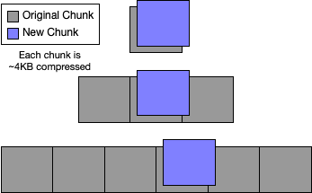
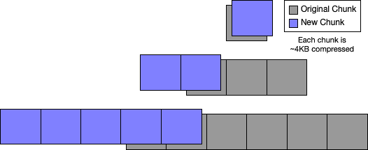

# Prolly Trees

In this section we explore how Dolt uses Prolly Trees.

We draw on a [blog post](https://www.dolthub.com/blog/2020-04-01-how-dolt-stores-table-data/) we published about Prolly Trees, and an excellent [write up](https://github.com/attic-labs/noms/blob/master/doc/intro.md#prolly-trees-probabilistic-b-trees) by the Noms team.

One key data structure that Noms employs is the Prolly Tree, used for storing collections. A Prolly Tree combines ideas from [B-Trees](https://en.wikipedia.org/wiki/B-tree) and [Merkle Trees](https://en.wikipedia.org/wiki/Merkle\_tree).

B-Trees are block oriented data structures with sorted key-value pairs stored at leaf nodes. Internal nodes store pointers to child nodes and ranges of keys which those child nodes provide access to. Reading from a B-Tree index for a given set of keys involves locating a range in which the desired key is located and following the pointers down the tree until arriving at the leaf node that stores the desired value. Prolly Trees resemble B-Trees in that they store all key-value data in leaf nodes, exactly like a B-tree, and internal nodes with key delimiters and pointers to their children, exactly like a B-tree.

The point of difference is where Prolly Trees draw on ideas from Merkle Trees, widely used in distributed protocols such as Bitcoin and IPFS. Instead of internal nodes storing pointers to child nodes, and leaf nodes storing key value pairs, both the leaf nodes and the internal nodes are variable-length and content-addressed. The child pointers of the internal nodes are the content addresses of the leaf or internal nodes that they point to. This means the values themselves can be stored in an immutable content-addressed chunk store, and the content addresses used as the "pointers" in the Prolly Tree.

When a value in a Prolly Tree changes, we only write the new value to a content addressed chunk, and recompute the nodes that lead to that chunk. The rest of the tree remains unchanged. The result is a storage footprint of new versions proportional to the size of the changes in the new version. This is called structural sharing.

## Structural Sharing

To see how this structural sharing works in practice, let's examine a couple of scenarios for updating a prolly tree backing a Dolt table.

* The absolute smallest overhead for any mutation to a prolly tree is, on average, a little larger than 4KB times the depth of the tree. Typically changing the value in a chunk won't change the chunk boundary, and you'll need to store complete new chunk values for the new leaf chunk and all the new internal chunks up to the root.

The best case scenario looks like:

* Adding rows to a table whose primary keys are lexicographically larger than any of the existing rows in the table results in an append at the end of Prolly-tree for the table value. The last leaf node in the tree will necessarily change, and new chunks will be created for all of the new rows. Expected duplicate storage overhead is going to be the 4KB chunk at the end of the table's leaf nodes and the spline of the internal nodes of the map leading up to the root node. This kind of table might represent naturally append-only data or time-series data, and the storage overhead is very small. This looks like:

.png>)

* Adding rows to a table whose primary keys are lexicographically smaller than any of the existing rows is very similar to the case where they are all larger. It's expected to rewrite the first chunks in the table, and the probabilistic rolling hash will quickly resynchronize with the existing table data. It might look like:

* Adding a run of data whose primary keys fall lexicographically within two existing rows is very similar to the prefix or postfix case. The run of data gets interpolated between the existing chunks of row data:

.png>)
